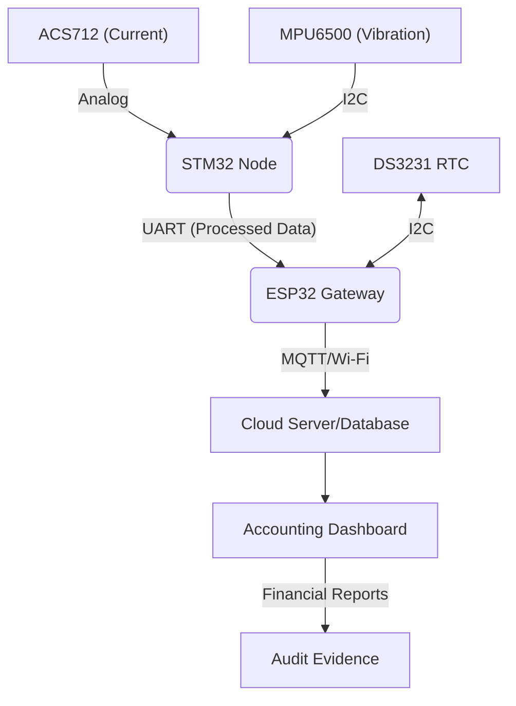

# IoT-Asset-Depreciation: Real-time Fixed Asset Monitoring System

## 1. Introduction
This project provides a specialized IoT solution designed to automate the calculation of **Fixed Asset Depreciation** based on actual operational hours. By integrating **STM32** and **ESP32**, the system moves beyond traditional "Straight-line" depreciation to a high-precision, data-driven approach. It ensures that manufacturing costs are recognized in strict accordance with the **Matching Principle** in accounting, providing immutable electronic audit evidence for industrial machinery.

## 2. System Architecture
The system utilizes a dual-microcontroller architecture to separate high-speed signal processing from network communication:
- **Processing Node (STM32F103):** Performs high-frequency ADC sampling from current sensors and processes IMU data to verify machine status via digital filtering.

## 3. Technology Stack
Hardware: STM32F103C8T6 (Blue Pill), ESP32-WROOM-32, ACS712 (5A/30A), MPU6500 (IMU), DS3231 (RTC).
Communication: UART (Inter-chip), I2C (Sensors), MQTT (Telemetric Data), NTP (Time Sync).
Embedded Software: C (STM32 HAL Library), C++ (Arduino/ESP32 Framework).
Backend/Analytics: Node-RED/Python, InfluxDB (Time-series data), Grafana (Dashboard).

## 4. Key Features
Cross-Validation Logic: Combines electrical load (Current) and mechanical movement (Vibration) to eliminate "false positives" in activity tracking, ensuring 99.9% data accuracy.
Immutable Audit Trail: Every operational second is timestamped by an independent RTC/NTP source, creating a transparent log that prevents manual tampering of depreciation data.
Precision Cost Allocation: Automatically calculates and allocates depreciation expenses into General Manufacturing Overhead (Account 627) based on real-time usage.
Edge Computing & Fail-safe: STM32 performs local noise filtering (Moving Average) to reduce server load, while the system supports offline logging during network outages.
Industrial Scale-down Prototype: Designed with a clear path from breadboard testing to professional Integrated PCB and Solidworks-modeled enclosures for factory environments.
